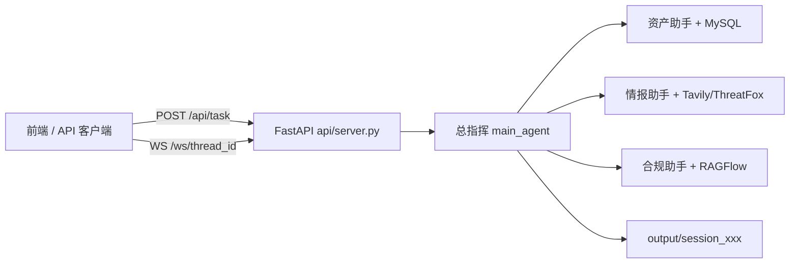

# 企业资产漏洞合规与威胁研判系统 — 从零构建与运行指南

本文档说明如何在本地从零搭建并运行本项目（基于 DeepAgents 的「1 主 + 3 专」多智能体后端）。

---

## 一、系统简介

### 1.1 做什么

面向开放环境的企业资产漏洞合规与威胁研判：总指挥负责调度与交互问答及生成 PDF 报告，三位子智能体分别负责：

| 角色 | 模块 | 能力 |
|------|------|------|
| 总指挥 | `agent/main_agent.py` | 任务拆解、调度子智能体、生成 Markdown/PDF 报告 |
| 资产与日志分析助手 | `database_query_agent` | 查询 MySQL 资产表、漏洞台账 |
| 网络空间情报助手 | `network_search_agent` | Tavily 外网检索、ThreatFox C2 检测 |
| 合规法律法规助手 | `knowledge_base_agent` | RAGFlow 知识库问答 |

### 1.2 技术栈

- **Python 3.10+**（推荐 3.11）
- **FastAPI + Uvicorn**：HTTP / WebSocket API
- **LangChain + LangGraph + DeepAgents**：多智能体编排
- **MySQL**：资产与漏洞仿真台账
- **RAGFlow**：合规知识库（可选但合规子智能体需要）
- **Tavily**：互联网 OSINT
- **Microsoft Word（Windows）**：Markdown → PDF（通过 COM）

### 1.3 架构示意



---

## 二、环境准备

### 2.1 必备软件

| 软件 | 用途 | 备注 |
|------|------|------|
| Python 3.10+ | 运行后端 | 安装时勾选「Add to PATH」 |
| MySQL 8.x | 资产/漏洞台账 | 本地或远程均可 |
| Git | 拉取代码 | 可选 |
| Microsoft Word | PDF 导出 | **仅 Windows**；无 Word 时 Markdown 仍可生成 |
| RAGFlow 服务 | 合规检索 | 自建或使用已有实例 |

### 2.2 需要申请的 API Key

| 变量名 | 说明 |
|--------|------|
| `OPENAI_API_KEY` + `OPENAI_BASE_URL` | 大模型（OpenAI 兼容接口，如 DeepSeek） |
| `TAVILY_API_KEY` | 外网搜索，[Tavily](https://tavily.com/) 注册 |
| `RAGFLOW_API_KEY` + `RAGFLOW_API_URL` | RAGFlow 服务地址与密钥 |
| ThreatFox | **无需 Key**，`check_c2_threat_intelligence` 直接调用公网接口 |

---

## 三、获取代码与目录结构

```bash
# 若从仓库克隆（示例）
git clone <你的仓库地址> deep_search_pro
cd deep_search_pro
```

```
deep_search_pro/
├── agent/                 # 主智能体、子智能体、LLM、提示词加载
│   ├── main_agent.py      # 装配与 run_deep_agent 入口
│   ├── llm.py             # 大模型初始化
│   ├── prompts.py         # 加载 prompt/prompts.yml
│   └── subagents/         # 三个子智能体配置
├── api/
│   ├── server.py          # FastAPI 服务（任务、上传、WebSocket）
│   ├── context.py         # ContextVars 会话隔离
│   └── monitor.py         # 工具/子智能体进度推送到前端
├── tools/                 # LangChain @tool 工具集
├── prompt/prompts.yml     # 总指挥与子智能体提示词
├── sql/init_asset_vuln_db.sql   # 数据库初始化脚本
├── rawflow/rag_config.py  # RAGFlow 环境变量加载
├── utils/                 # 路径解析、Word 转 PDF
├── output/                # 运行时报告输出（按 session 隔离）
├── updated/               # 用户上传文件暂存
├── .env                   # 环境变量（需自行创建，勿提交密钥）
└── requirements.txt
```

---

## 四、Python 虚拟环境与依赖

### 4.1 创建虚拟环境（推荐）

**Windows（PowerShell）：**

```powershell
cd C:\Users\admin\Desktop\deep_search_pro
python -m venv .venv
.\.venv\Scripts\Activate.ps1
python -m pip install -U pip
pip install -r requirements.txt
```

**macOS / Linux：**

```bash
cd deep_search_pro
python3 -m venv .venv
source .venv/bin/activate
pip install -U pip
pip install -r requirements.txt
```

> PDF 转换依赖 `pywin32`，仅在 Windows 下生效；Linux 部署需另行替换 `utils/word_converter.py` 中的实现。

### 4.2 验证关键包

```bash
python -c "import fastapi, deepagents, langchain, mysql.connector; print('OK')"
```

---

## 五、配置 `.env`

在项目根目录创建或编辑 `.env`（**不要**将真实密钥提交到 Git）：

```env
# ---------- 大模型（OpenAI 兼容） ----------
OPENAI_BASE_URL=https://api.deepseek.com/v1
OPENAI_API_KEY=你的_API_Key
LLM_QWEN_MAX=deepseek-chat

# ---------- Tavily 外网搜索 ----------
TAVILY_API_KEY=你的_Tavily_Key

# ---------- RAGFlow 合规知识库 ----------
RAGFLOW_API_URL=http://你的-ragflow-host
RAGFLOW_API_KEY=你的_RAGFlow_Key

# ---------- MySQL 资产漏洞台账 ----------
MYSQL_HOST=localhost
MYSQL_PORT=3306
MYSQL_USER=root
MYSQL_PASSWORD=你的密码
MYSQL_DATABASE=asset_vuln_db
```

说明：

- `LLM_QWEN_MAX` 由 `agent/llm.py` 读取，经 `init_chat_model(..., model_provider="openai")` 调用。
- 请将 `MYSQL_DATABASE` 设为独立库名（如 `asset_vuln_db`），与旧医药库 `pharma_db` 区分。

---

## 六、初始化 MySQL 数据库

### 6.1 创建数据库

```sql
CREATE DATABASE IF NOT EXISTS asset_vuln_db
  DEFAULT CHARACTER SET utf8mb4
  COLLATE utf8mb4_unicode_ci;
```

### 6.2 执行初始化脚本

**命令行：**

```bash
mysql -u root -p asset_vuln_db < sql/init_asset_vuln_db.sql
```

**或 MySQL 客户端内：**

```sql
USE asset_vuln_db;
SOURCE C:/Users/admin/Desktop/deep_search_pro/sql/init_asset_vuln_db.sql;
```

脚本会创建：

- `company_assets` — 企业资产
- `asset_vulnerabilities` — 资产漏洞

并插入 5 条仿真「未修复高危/严重」数据（含 `CVE-2026-23345`、暴露面 IP `203.0.113.88` 等），供 Agent 研判联调。

### 6.3 验证数据

```sql
SELECT a.server_name, a.ip_address, a.is_internet_exposed,
       v.cve_id, v.severity, v.repair_status
FROM company_assets a
JOIN asset_vulnerabilities v ON a.asset_id = v.asset_id
WHERE v.repair_status = '未修复';
```

### 6.4 本地快速测库连接

```bash
python -c "from tools.mysql_tools import list_sql_tables; print(list_sql_tables.invoke({}))"
```

---

## 七、配置合规知识库 RAG

合规子智能体由 `.env` 中 **`RAG_BACKEND`** 决定后端：

| 值 | 说明 |
|----|------|
| `milvus`（推荐本地） | 使用 **Milvus** + `rawflow/ragdata` 数据集，无需 RAGFlow 服务 |
| `ragflow` | 使用远程 **RAGFlow** API |

### 7A. 本地 Milvus RAG（当前默认）

**组件：**

| 组件 | 本项目配置 |
|------|------------|
| 向量数据库 | **Milvus**（`localhost:19530`） |
| 嵌入模型 | 默认 **BAAI/bge-small-zh-v1.5**（`EMBEDDING_PROVIDER=fastembed`，ONNX 本地推理，无需 torch） |
| 原始数据 | `rawflow/ragdata/Cybersecurity-High-Quality-Dataset/*.jsonl`（约 27 万条） |

**步骤：**

1. 启动 Milvus（Docker 示例）：

```bash
docker run -d --name milvus -p 19530:19530 -p 9091:9091 milvusdb/milvus:latest
```

2. 安装依赖：

```bash
pip install pymilvus langchain-milvus fastembed
```

3. 在 `.env` 中确认（已预置可改）：

```env
RAG_BACKEND=milvus
MILVUS_HOST=localhost
MILVUS_PORT=19530
MILVUS_COLLECTION=cybersecurity_kb
EMBEDDING_PROVIDER=fastembed
EMBEDDING_MODEL=BAAI/bge-small-zh-v1.5
INGEST_MAX_ROWS=1000
```

> **若 `EMBEDDING_PROVIDER=huggingface` 报 torch/transformers 错误**：这是 PyTorch 与 transformers 版本不兼容，请改用 `fastembed`（见上），不要强行升级整个 conda 环境的 torch。

4. **入库**（先小批量试跑，再改 `INGEST_MAX_ROWS=0` 全量）：

```powershell
cd C:\Users\admin\Desktop\deep_search_pro
python scripts/ingest_ragdata_to_milvus.py
```

5. 验证检索：

```bash
python -c "from tools.local_rag_tools import get_assistant_list, create_ask_delete; print(get_assistant_list.invoke({})); print(create_ask_delete.invoke({'chat_name':'网络安全合规知识库（本地）','question':'网络安全法对数据出境有哪些要求？'}))"
```

**说明：** 你的 `connections.connect(host=localhost, port=19530)` 与项目内 `rawflow/milvus_store.py` 使用相同地址；数据不会自动进 Milvus，必须执行入库脚本。

### 7B. 远程 RAGFlow（可选）

1. 部署 [RAGFlow](https://github.com/infiniflow/ragflow) 并在控制台创建助手、上传文档。
2. `.env` 设置 `RAG_BACKEND=ragflow`，配置 `RAGFLOW_API_URL`、`RAGFLOW_API_KEY`。
3. 向量库与 Embedding 由 **RAGFlow 服务端** 决定（常见为 Elasticsearch/Infinity + 控制台所选 Embedding），与本项目代码无关。

```bash
python -c "from tools.ragflow_tools import get_assistant_list; print(get_assistant_list.invoke({}))"
```

---

## 八、启动后端服务

在项目根目录、已激活虚拟环境下执行：

```bash
python api/server.py
```

或：

```bash
uvicorn api.server:app --host 0.0.0.0 --port 8000 --reload
```

启动成功后：

- API 文档：<http://127.0.0.1:8000/docs>
- 默认端口：`8000`

> 首次导入 `agent.main_agent` 会加载模型与工具，可能需要数秒，属正常现象。

---

## 九、API 使用说明

### 9.1 建立 WebSocket（接收实时进度）

连接（`thread_id` 与后续任务保持一致）：

```
ws://127.0.0.1:8000/ws/{thread_id}
```

服务端会推送 `monitor_event`，例如：

- `session_created` — 工作目录已创建
- `tool_start` — 工具开始执行
- `assistant_call` — 正在调用子智能体
- `task_result` — 总指挥最终回复
- `error` — 执行异常

### 9.2 提交研判任务

```http
POST /api/task
Content-Type: application/json

{
  "query": "请对企业互联网暴露面未修复高危漏洞进行合规与威胁研判，并生成PDF风险评估报告。",
  "thread_id": "demo-session-001"
}
```

响应示例：

```json
{
  "status": "started",
  "thread_id": "demo-session-001"
}
```

任务在后台异步执行；进度通过 WebSocket 推送。

### 9.3 上传参考文件（可选）

```http
POST /api/upload
Content-Type: multipart/form-data

files: <文件>
thread_id: demo-session-001
```

文件保存至 `updated/session_{thread_id}/`，执行 `run_deep_agent` 时会复制到 `output/session_{thread_id}/`，供 `read_file_content` 读取。

### 9.4 查看与下载生成文件

列出会话目录下文件（`path` 为 **output 下的绝对路径**）：

```http
GET /api/files?path=C:\...\deep_search_pro\output\session_demo-session-001
```

下载：

```http
GET /api/download?path=C:\...\output\session_demo-session-001\风险评估报告.pdf
```

---

## 十、一次完整联调流程（推荐顺序）

1. 启动 MySQL，执行 `sql/init_asset_vuln_db.sql`。
2. 配置 `.env` 中 LLM、MySQL、Tavily、RAGFlow。
3. `pip install -r requirements.txt`。
4. 启动 `python api/server.py`。
5. 浏览器或工具连接 `ws://127.0.0.1:8000/ws/test-001`。
6. `POST /api/task`，`thread_id` 使用 `test-001`，query 见上文示例。
7. 观察 WebSocket：子智能体调用 → 工具埋点 → 最终 `task_result`。
8. 在 `output/session_test-001/` 查看生成的 `.md` 与 `.pdf`。

---

## 十一、总指挥执行逻辑（便于排错）

`run_deep_agent` 核心步骤（见 `agent/main_agent.py`）：

1. 创建 `output/session_{session_id}/`。
2. 若有上传文件，从 `updated/session_{id}/` 复制到 output 目录。
3. `set_session_context` / `set_thread_context` 写入 ContextVars（工具层取路径、WebSocket 定向推送）。
4. 用户问题 + 【工作环境指令】发给 `main_agent.astream`。
5. 总指挥应先调度三个子智能体收集数据，再调用 `generate_markdown` → `convert_md_to_pdf`。
6. `finally` 中 `reset_session_context`，防止多用户串台。

---

## 十二、常见问题

### Q1：导入 `agent.main_agent` 报错 `No module named 'ragflow_sdk'`

```bash
pip install ragflow-sdk
```

### Q2：MySQL 连接失败

- 检查 `.env` 中 `MYSQL_*` 是否与实例一致。
- 确认已 `CREATE DATABASE` 并执行初始化脚本。
- 防火墙是否放行 3306。

### Q3：子智能体查不到表

- 确认连接的是 `MYSQL_DATABASE` 指定的库，而非空的 `pharma_db` 等旧库。
- 重新执行 `sql/init_asset_vuln_db.sql`。

### Q4：PDF 转换失败

- 当前实现依赖 **Windows + 已安装 Microsoft Word + pywin32**。
- 若仅需 Markdown，可暂时只调用 `generate_markdown`。

### Q5：Tavily / ThreatFox 无结果

- Tavily：检查 `TAVILY_API_KEY` 与网络。
- ThreatFox：公网 API，失败时会尝试 `203.0.113.88` 的静态仿真保底数据。

### Q6：WebSocket 收不到推送

- 确认 `thread_id` 与 `/api/task` 请求体一致。
- 任务须在 `startup_event` 之后发起（服务已绑定事件循环）。

### Q7：大模型报错 401 / 404

- 核对 `OPENAI_BASE_URL`、`OPENAI_API_KEY`、`LLM_QWEN_MAX` 模型名是否与厂商文档一致。

---

## 十三、环境变量速查表

| 变量 | 必填 | 说明 |
|------|------|------|
| `OPENAI_API_KEY` | 是 | 大模型密钥 |
| `OPENAI_BASE_URL` | 是 | 兼容 OpenAI 的 API 地址 |
| `LLM_QWEN_MAX` | 是 | 模型名称 |
| `MYSQL_HOST` | 是 | 数据库主机 |
| `MYSQL_PORT` | 否 | 默认 3306 |
| `MYSQL_USER` | 是 | 数据库用户 |
| `MYSQL_PASSWORD` | 是 | 数据库密码 |
| `MYSQL_DATABASE` | 是 | 库名，建议 `asset_vuln_db` |
| `TAVILY_API_KEY` | 是* | 外网检索（情报助手） |
| `RAGFLOW_API_URL` | 是* | 合规助手 |
| `RAGFLOW_API_KEY` | 是* | 合规助手 |

\* 若跳过对应子智能体能力，可暂不配，但全流程演示建议齐全。

---

## 十四、生产部署建议（简要）

- 使用 `gunicorn` + `uvicorn workers` 或容器化部署 FastAPI。
- `.env` 改为密钥管理服务（勿明文进镜像）。
- `output/`、`updated/` 挂载持久卷。
- Linux 环境请替换 Word COM 的 PDF 方案（如 WeasyPrint、wkhtmltopdf）。
- 为 MySQL、RAGFlow 配置内网访问与最小权限账号。

---

## 十五、相关文件索引

| 需求 | 文件 |
|------|------|
| 改总指挥/子智能体话术 | `prompt/prompts.yml` |
| 改 API 路由 | `api/server.py` |
| 改 SQL 工具 | `tools/mysql_tools.py` |
| 改外网/C2 情报 | `tools/security_osint_tools.py` |
| 改合规 RAG | `tools/ragflow_tools.py` |
| 数据库表结构/种子数据 | `sql/init_asset_vuln_db.sql` |

---

如有前端工程，需将 API 基址指向 `http://<后端主机>:8000`，WebSocket 指向 `ws://<后端主机>:8000/ws/{thread_id}`，并与 `/api/task` 使用相同 `thread_id`。
