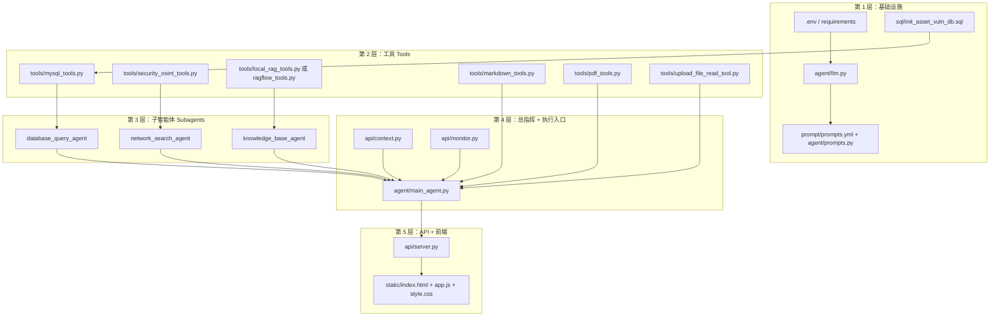

# 基于DeepAgents的企业安全多智能体情报系统 


## 一、项目目标与最终形态

### 1.1助手架构介绍

**企业网络安全智能助手**：用户用自然语言提问或发起研判任务，系统由 **1 个总指挥 + 3 个子智能体** 协作回答，并在需要时生成 Markdown / PDF 风险评估报告。

| 角色               | 代码位置                                  | 职责                                                      |
| ------------------ | ----------------------------------------- | --------------------------------------------------------- |
| 总指挥             | `agent/main_agent.py`                     | 判断问答 / 完整研判模式，调度子智能体，整合结论，生成报告 |
| 资产与日志分析助手 | `agent/subagents/database_query_agent.py` | MySQL 资产、漏洞台账查询                                  |
| 网络空间情报助手   | `agent/subagents/network_search_agent.py` | Tavily 外网检索、ThreatFox C2 情报                        |
| 合规法律法规助手   | `agent/subagents/knowledge_base_agent.py` | Milvus 本地 RAG 或远程 RAGFlow 合规检索                   |

### 1.2 技术选型

| 层次     | 选型                                   | 原因                                            |
| -------- | -------------------------------------- | ----------------------------------------------- |
| Web 服务 | FastAPI + Uvicorn                      | 异步友好，自带 OpenAPI                          |
| 多智能体 | LangChain + LangGraph + **DeepAgents** | `create_deep_agent` 内置子智能体 `task` 调度    |
| 大模型   | OpenAI 兼容 API（如 DeepSeek）         | `init_chat_model(..., model_provider="openai")` |
| 工具     | `@tool`（langchain_core.tools）        | 与 DeepAgents / LangGraph 无缝集成              |
| 会话隔离 | `ContextVar`                           | 异步多用户不串台                                |
| 实时进度 | WebSocket + 单例 `ToolMonitor`         | 工具/子智能体事件推前端                         |

### 1.3 分层架构（实现时按层自下而上）



---

## 二、实现顺序总览

按**可验证、可增量**原则，分 **12 个阶段** 完成。

| 阶段 | 模块              | 产出物                                            | 验证方式                            |
| :--: | ----------------- | ------------------------------------------------- | ----------------------------------- |
|  0   | 项目骨架          | 目录、`requirements.txt`、`.env` 模板             | `pip install` 成功                  |
|  1   | 大模型 + 提示词   | `llm.py`、`prompts.yml`、`prompts.py`             | 单轮 `model.invoke`                 |
|  2   | MySQL 数据层      | `sql/*.sql`、`mysql_tools.py`                     | 脚本列出表                          |
|  3   | 资产子智能体      | `database_query_agent.py`                         | 命令行调一个 `@tool`                |
|  4   | 最小总指挥        | 仅挂 MySQL 子智能体的 `main_agent`                | `astream` 能查库回答                |
|  5   | OSINT 情报        | `security_osint_tools.py`、`network_search_agent` | Tavily / ThreatFox 有返回           |
|  6   | 合规 RAG          | Milvus + `milvus_store.py` + `local_rag_tools.py` | 检索一条法条切片                    |
|  7   | 报告与路径        | `path_utils.py`、`markdown_tools`、`pdf_tools`    | 本地生成 `.md` / `.pdf`             |
|  8   | 三专 + 完整总指挥 | 三个 subagent + 完整 `prompts.yml`                | 一次完整研判对话                    |
|  9   | 会话上下文        | `api/context.py` + `run_deep_agent`               | 多 `thread_id` 文件不混             |
|  10  | API + WebSocket   | `server.py`、`monitor.py`                         | Postman / `curl` + WS 收事件        |
|  11  | 上传与文件 API    | `/api/upload`、`/api/files`                       | 上传后 Agent 能 `read_file_content` |
|  12  | 前端              | `static/*`                                        | 浏览器完整联调                      |

> **原则**：先让「大模型 + 一个工具」跑通，再加子智能体；先命令行/脚本验证，再接 FastAPI；最后做 UI。

---

## 三、阶段 0：项目骨架

### 3.1 创建目录

```text
deep_search_pro/
├── agent/
│   ├── llm.py
│   ├── prompts.py
│   ├── main_agent.py
│   └── subagents/
├── api/
│   ├── server.py
│   ├── context.py
│   └── monitor.py
├── tools/
├── prompt/
│   └── prompts.yml
├── sql/
├── rawflow/          # Milvus 与数据集（阶段 6 再用）
├── scripts/
├── utils/
├── output/           # 运行时生成，可加 .gitkeep
├── updated/          # 用户上传暂存
├── static/           # 阶段 12
├── .env
└── requirements.txt
```

### 3.2 依赖清单

从 `requirements.txt` 安装核心包即可，开发期最少需要：

- `fastapi`、`uvicorn`、`python-dotenv`
- `langchain`、`langchain-openai`、`langgraph`、`deepagents`
- `mysql-connector-python`、`PyYAML`
- 阶段 5：`tavily-python`、`requests`
- 阶段 6：`pymilvus`、`fastembed`
- 阶段 7（Windows PDF）：`pywin32`、`python-docx`

### 3.3 `.env` 模板

先只配大模型与 MySQL，后续阶段再补 `TAVILY_API_KEY`、`MILVUS_*` 等。

---

## 四、阶段 1：大模型与提示词基础设施

### 4.1 实现 `agent/llm.py`

**做法**：

1. `load_dotenv(find_dotenv())` 加载根目录 `.env`。
2. 使用 `langchain.chat_models.init_chat_model`，`model=os.getenv("LLM_QWEN_MAX")`，`model_provider="openai"`。
3. 模块级导出单例 `model`，供全局复用。

**验证**：

```python
from agent.llm import model
print(model.invoke("你好，回复 OK").content)
```

### 4.2 实现 `prompt/prompts.yml` + `agent/prompts.py`

**做法**：

1. YAML 分两块：`main_agent.system_prompt`、`sub_agents` 下三个子智能体的 `name` / `description` / `system_prompt`。
2. `prompts.py` 用 `yaml.safe_load` 在**模块导入时**加载一次，导出 `main_agent_content`、`sub_agents_content`。
3. 提示词要写明：总指挥用 `task` 工具调度子智能体（`subagent_type` 为配置里的英文 key）。

**本阶段先写简短版总指挥提示词**，阶段 8 再补全「问答模式 / 完整研判模式」规则。

---

## 五、阶段 2：MySQL 数据层与工具

### 5.1 数据库脚本 `sql/init_asset_vuln_db.sql`

**做法**：

1. 建库 `asset_vuln_db`（或在脚本外 `CREATE DATABASE`）。
2. 表 `company_assets`（资产）、`asset_vulnerabilities`（漏洞）。
3. 插入若干**未修复高危**且**互联网暴露**的仿真数据，便于演示「暴露面 + CVE」场景。

### 5.2 实现 `tools/mysql_tools.py`

**做法**（每个函数都是 `@tool`）：

| 工具                | 作用                               |
| ------------------- | ---------------------------------- |
| `list_sql_tables`   | `SHOW TABLES`，让模型知道有哪些表  |
| `get_table_data`    | 预览表结构/样例行                  |
| `execute_sql_query` | 仅允许 `SELECT`，结果转 CSV 字符串 |

**实现要点**：

- `get_db_config()` 从环境变量读连接信息，缺项抛明确错误。
- `_sanitize_table_name` 防 SQL 注入（表名白名单正则）。
- 每个工具开头调用 `monitor.report_tool(...)`（阶段 10 前可先 `print` 占位）。

**验证**：

```bash
python -c "from tools.mysql_tools import list_sql_tables; print(list_sql_tables.invoke({}))"
```

---

## 六、阶段 3：第一个子智能体（资产助手）

### 6.1 实现 `agent/subagents/database_query_agent.py`

子智能体在 DeepAgents 里**不是类**，而是一个 **dict 配置**：

```python
database_query_agent = {
    "name": sub_agents_content["database_query_agent"]["name"],
    "description": sub_agents_content["database_query_agent"]["description"],
    "system_prompt": sub_agents_content["database_query_agent"]["system_prompt"],
    "tools": [list_sql_tables, get_table_data, execute_sql_query],
}
```

- `description` 会被总指挥用来决定「何时调度」——要写清适用场景（内部台账 vs 外网 CVE）。
- `system_prompt` 约束：先 `list_sql_tables`，再 `execute_sql_query`，只读。

### 6.2 在 `prompts.yml` 中写好该子智能体话术

强调字段名：`repair_status`、`is_internet_exposed`、`severity` 等，避免模型编造列名。

**验证**：暂不接总指挥，直接对工具链提问（阶段 4 一起测）。

---

## 七、阶段 4：最小总指挥（仅 1 个子智能体）

### 7.1 实现 `agent/main_agent.py`（第一版）

```python
from deepagents import create_deep_agent
from langgraph.checkpoint.memory import InMemorySaver

main_agent = create_deep_agent(
    model=model,
    system_prompt=main_agent_content["system_prompt"],
    tools=[],  # 第一版可先不配报告工具
    checkpointer=InMemorySaver(),
    subagents=[database_query_agent],
)
```

### 7.2 同步测试脚本（建议 `test.py`）

```python
import asyncio

async def main():
    config = {"configurable": {"thread_id": "dev-001"}}
    async for chunk in main_agent.astream(
        {"messages": [{"role": "user", "content": "查询未修复的高危漏洞"}]},
        config=config,
    ):
        print(chunk)

asyncio.run(main())
```

**期望**：日志中出现 `task` 工具调用 `database_query_agent`，并最终返回含 CVE / IP 的自然语言答案。

**学到什么**：DeepAgents 通过 `tool_calls` 里 `name == "task"` 调度子智能体，`args` 含 `subagent_type` 与 `description`。

---

## 八、阶段 5：网络空间情报

### 8.1 实现 `tools/security_osint_tools.py`

| 工具                           | 实现                                                         |
| ------------------------------ | ------------------------------------------------------------ |
| `internet_search`              | `TavilyClient.search(...)`，格式化 title/url/content         |
| `check_c2_threat_intelligence` | POST `https://threatfox-api.abuse.ch/api/v1/`，解析 JSON；失败时用静态 IP 保底数据便于演示 |

申请 [Tavily](https://tavily.com/) API Key，写入 `.env` 的 `TAVILY_API_KEY`。

### 8.2 实现 `network_search_agent.py`

挂载 `[internet_search, check_c2_threat_intelligence]`，提示词说明：CVE 情报用 `internet_search`，暴露面 IP 的 C2 用 ThreatFox。

### 8.3 扩展总指挥

`subagents=[database_query_agent, network_search_agent]`，提示词增加「外网 CVE / 在野利用 → 调度 network_search_agent」。

**验证**：问「CVE-2023-46604 在野利用与缓解」应触发 Tavily，而非查 MySQL。

---

## 九、阶段 6：合规知识库（本地 Milvus）

### 9.1 基础设施

1. Docker 启动 Milvus（`19530` 端口）。
2. 准备数据集：`rawflow/ragdata/.../*.jsonl`。
3. 实现 `rawflow/milvus_store.py`：连接、`fastembed` 嵌入、`similarity_search`、集合统计。
4. 实现 `scripts/ingest_ragdata_to_milvus.py`：分批写入，`.env` 中 `INGEST_MAX_ROWS` 可先设小值试跑。

### 9.2 实现 `tools/local_rag_tools.py`

- `get_assistant_list` → 返回集合名、条数、数据路径
- `create_ask_delete(chat_name, question)` → 向量检索 Top-K 切片原文

### 9.3 实现 `knowledge_base_agent.py`

```python
_backend = os.getenv("RAG_BACKEND", "milvus").lower()
if _backend == "milvus":
    from tools.local_rag_tools import ...
else:
    from tools.ragflow_tools import ...  # 若你有远程 RAGFlow
```

**验证**：

```bash
python scripts/ingest_ragdata_to_milvus.py
python -c "from tools.local_rag_tools import create_ask_delete; print(create_ask_delete.invoke({'chat_name':'网络安全合规知识库（本地）','question':'数据安全法对出境的要求'}))"
```

---

## 十、阶段 7：报告生成与路径安全

### 10.1 `utils/path_utils.py`

实现 `resolve_path(filename, session_dir)`：

- 剥离 `/workspace` 等虚拟前缀；
- 相对路径一律落到 `output/session_{id}/`；
- 防止 `session_xxx/session_xxx/` 双重嵌套。

### 10.2 `tools/markdown_tools.py`

- `generate_markdown(content, filename, path="")`
- 从 `get_session_context()` 取当前会话目录，再 `resolve_path` 后写文件。

### 10.3 `tools/pdf_tools.py` + `utils/word_converter.py`

- `convert_md_to_pdf`：读 session 内 `.md`，Windows 下可用 Word COM 转 PDF（无 Word 则仅保留 Markdown）。
- 与 `generate_markdown` 一样上报 `monitor.report_tool`。

### 10.4 `tools/upload_file_read_tool.py`

- `read_file_content(filename)`：在 session 目录内读用户上传的参考文件。

**验证**：写死 `set_session_context("/path/to/output/session_test")` 后单独 invoke 两个报告工具。

---

## 十一、阶段 8：三专齐备 + 完整总指挥提示词

### 8.1 装配完整 `main_agent`

```python
main_agent = create_deep_agent(
    model=model,
    system_prompt=main_agent_content["system_prompt"],
    tools=[generate_markdown, convert_md_to_pdf, read_file_content],
    checkpointer=InMemorySaver(),
    subagents=[database_query_agent, network_search_agent, knowledge_base_agent],
)
```

### 8.2 完善 `prompts.yml` 中的模式划分

| 模式             | 触发条件                                | 总指挥行为                                                   |
| ---------------- | --------------------------------------- | ------------------------------------------------------------ |
| 问答模式（默认） | 单一问题、未要求 PDF/正式报告           | 只调必要子智能体，对话直接回答；**禁止** `generate_markdown` |
| 完整研判模式     | 综合性研判 + 明确要求 PDF/Markdown 报告 | 按需调度三专 → `generate_markdown` → `convert_md_to_pdf`     |

在 `sub_agents.*.system_prompt` 中区分「简短问答」与「研判供稿（完整 CSV）」两种返回格式。

**验证**（命令行 `run_deep_agent` 雏形或临时 async 函数）：

- 问答：「查询未修复高危漏洞」→ 无 md/pdf 文件。
- 研判：「对互联网暴露面未修复高危漏洞做合规与威胁研判，并生成 PDF 报告」→ `output/session_xxx/` 下有 `.md` 和 `.pdf`。

---

## 十二、阶段 9：异步执行入口与会话隔离

### 9.1 `api/context.py`

定义两个 `ContextVar`：

- `session_dir`：当前任务输出目录绝对路径
- `thread_id`：与 WebSocket、LangGraph `thread_id` 一致

提供 `set_*` / `get_*` / `reset_*`（在 `finally` 中 reset，防泄漏）。

### 9.2 实现 `run_deep_agent(task_query, session_id)`

**顺序**（与现网 `main_agent.py` 一致）：

1. 创建 `output/session_{session_id}/`。
2. 若存在 `updated/session_{id}/`，`shutil.copy2` 到 output 目录。
3. `set_session_context` + `set_thread_context` + `monitor.report_session_dir`。
4. 拼接用户问题 + 【工作环境指令】（工作目录、上传文件列表、问答/研判规则）。
5. `async for chunk in main_agent.astream(..., config={"configurable": {"thread_id": session_id}})`。
6. 解析 `chunk`：`node_name == "model"` 时，若有 `tool_calls` 且 `name == "task"` → `monitor.report_assistant`；若有 `content` → `monitor.report_task_result`。
7. `finally`：`reset_session_context`。

**验证**：连续两个不同 `session_id` 并发 `create_task`，检查 output 目录互不写入。

---

## 十三、阶段 10：FastAPI 与 WebSocket 监控

### 10.1 `api/monitor.py`

- **`ToolMonitor` 单例**：`_emit` 构造 `{type: monitor_event, event, message, data, timestamp}`。
- 通过 `ConnectionManager.send_to_thread(payload, thread_id)` 推送；注意 `asyncio.get_running_loop()` 与 `run_coroutine_threadsafe` 的分支（Agent 在 `create_task` 内与 WS 同 loop 时用 `create_task`）。
- 工具层、子智能体层分别调用 `report_tool`、`report_assistant`。

### 10.2 `api/server.py`

| 路由                        | 实现要点                                                     |
| --------------------------- | ------------------------------------------------------------ |
| `GET /`                     | 返回 `static/index.html`                                     |
| `POST /api/task`            | `asyncio.create_task(run_deep_agent(...))`，立即返回 `{status, thread_id}` |
| `WebSocket /ws/{thread_id}` | `manager.connect`；循环 `receive_text` 作心跳                |
| `startup`                   | `manager.set_loop(asyncio.get_running_loop())`               |

项目根加入 `sys.path`，保证 `from agent.main_agent import run_deep_agent` 可用。

**验证**：

1. 先连 `ws://127.0.0.1:8000/ws/demo-1`。
2. 再 `POST /api/task`，`thread_id: demo-1`。
3. WS 应收到 `session_created`、`assistant_call`、`tool_start`、`task_result`。

---

## 十四、阶段 11：文件上传与下载 API

### 11.1 `POST /api/upload`

- `multipart`：`files` + `thread_id`（Form）。
- 保存到 `updated/session_{thread_id}/`。
- `run_deep_agent` 启动时复制到 output（阶段 9 已实现）。

### 11.2 `GET /api/files` 与 `GET /api/download`

- 查询参数 `path` 必须是 **output 目录下的绝对路径**（`Path.is_relative_to(output_dir)` 防路径遍历）。
- `list_files` 递归 `rglob`，返回 name、size、mtime。
- `download` 用 `FileResponse`。

---

## 十五、阶段 12：前端静态页

### 12.1 文件分工

| 文件                | 职责                                                         |
| ------------------- | ------------------------------------------------------------ |
| `static/index.html` | 布局：侧栏（会话 ID、快捷提问、上传）、主区（对话流、输入框） |
| `static/style.css`  | 深色科技感 UI、消息气泡、事件徽章                            |
| `static/app.js`     | WebSocket 连接、`POST /api/task`、渲染 `monitor_event`、上传与文件列表 |

### 12.2 前端关键逻辑

1. **会话 ID**：`threadId` 输入框；空则生成 `session-{timestamp}`。
2. **连接**：`ws://${location.host}/ws/${threadId}`，更新状态 pill。
3. **发任务**：`fetch('/api/task', { method:'POST', body: JSON.stringify({ query, thread_id }) })`。
4. **事件映射**：`tool_start` / `assistant_call` / `task_result` / `error` → 不同样式的聊天气泡。
5. **上传**：`FormData` 带 `thread_id`，成功后启用「输出文件」按钮，`GET /api/files?path=${sessionPath}`。

`server.py` 中 `app.mount("/static", StaticFiles(...))` 与 `GET /` 返回 index。

**验证**：浏览器打开 `http://127.0.0.1:8000/`，走一遍「连接 → 快捷提问 → 看进度 → 下载报告」。


## 十六、扩展方向

完成主链路后，可按优先级扩展：

1. **持久化会话**：将 `InMemorySaver` 换为 Redis / Postgres checkpointer。
2. **Linux PDF**：用 WeasyPrint / md2pdf 替代 Word COM。
3. **鉴权**：API Key 或 JWT，WebSocket 握手校验。
4. **子智能体并行**：在总指挥提示词中允许「一次 task 描述多路并行」（取决于 DeepAgents 版本能力）。
5. **评测集**：固定 10 条 prompt + 期望调用的子智能体，做回归测试。

---

## 十八、核心代码索引

| 需求                    | 文件                                                         |
| ----------------------- | ------------------------------------------------------------ |
| 改总指挥 / 子智能体话术 | `prompt/prompts.yml`                                         |
| 增删工具                | `tools/*.py`，并在对应 `subagents/*.py` 注册                 |
| 改调度与流式推送        | `agent/main_agent.py`                                        |
| 改 API 路由             | `api/server.py`                                              |
| 改 WS 事件格式          | `api/monitor.py`、`static/app.js`                            |
| 改路径安全              | `utils/path_utils.py`                                        |
| 改表结构 / 种子数据     | `sql/init_asset_vuln_db.sql`                                 |
| Milvus 入库             | `scripts/ingest_ragdata_to_milvus.py`、`rawflow/milvus_store.py` |

---

*文档版本与仓库代码同步；若某文件路径不存在，以你当前分支为准，并按阶段补全。*
